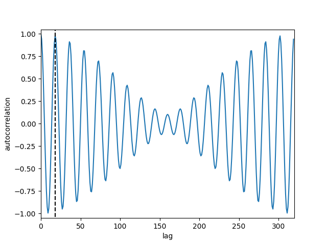

# TOTOCOR

A simple package for computing the autocorrelation of a signal.

## Installation 

Build from source : 
```bash
    git clone https://github.com/SneachChea/totocor.git
    cd totocor
    pip install -r requirements.txt
    pip install .
```

## How to use totocor? 

totocor is a simple package for computing the autocorrelation of time series.  
Totocor takes any numpy array. The last dimension is considered to be the temporal dimension.  
**example of use** :
```python
import numpy as np
from totocor.totocor import autocorr

t = np.linspace(0, 1, 8000)
signal = np.sin(2*np.pi*440*t) # shape [8000]

ac_sig = autocorr(signal, window_size=320, hop_length=160, window_fn="hamming", normalization=True) # shape [51, 320]


```


## What is the point of computing the autocorrelation? 

### Create a pitch detector 🎶

Actually, autocorrelation is very helpful for analysing a time serie. For instance, the easiest way to compute the Pitch of a voiced frame is to get the second highest peak of the correlation of a frame with itself (the autocorrelation, in other words).  
For instance, if you check the autocorrelation of the example above, the lag corresponding of the second peak (after the one at 0) is 18. The fundamental frequency is then the sampling frequency divided by the lag, *i.e.* $8000/18 \approx 444 Hz$, which is close to the actual frequency ($440Hz$).


Finding the second highest peak is, however a more difficult task than you can imagine, so it will be done in the future 🤷‍♂️.


